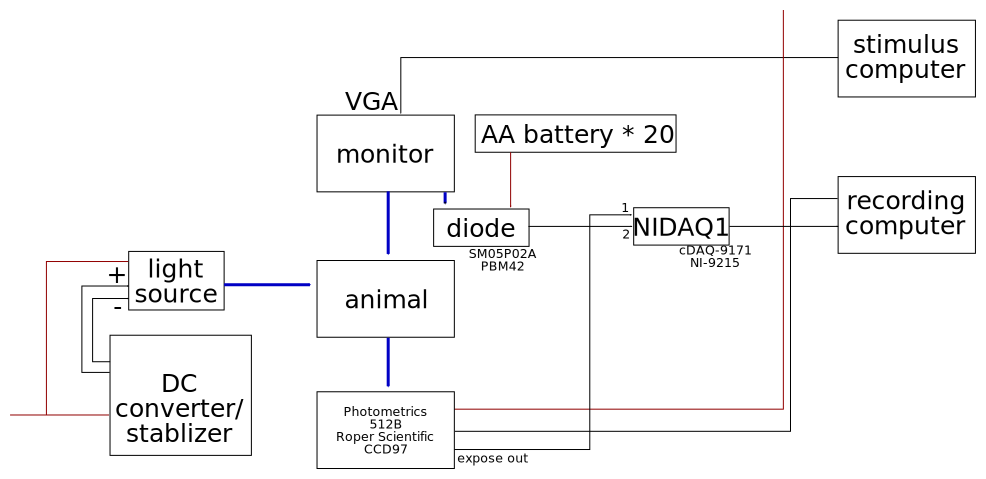
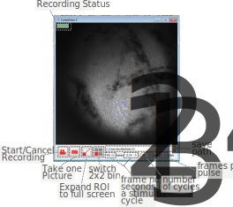
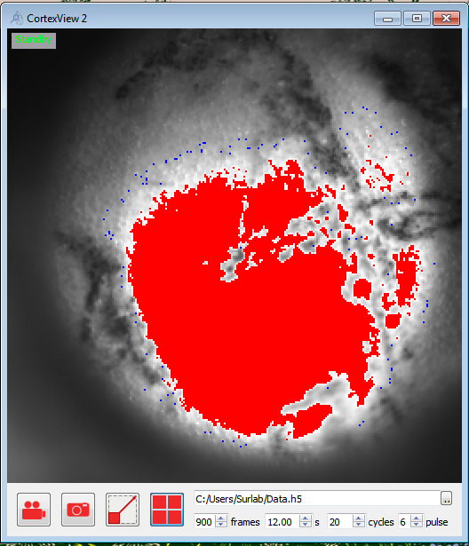
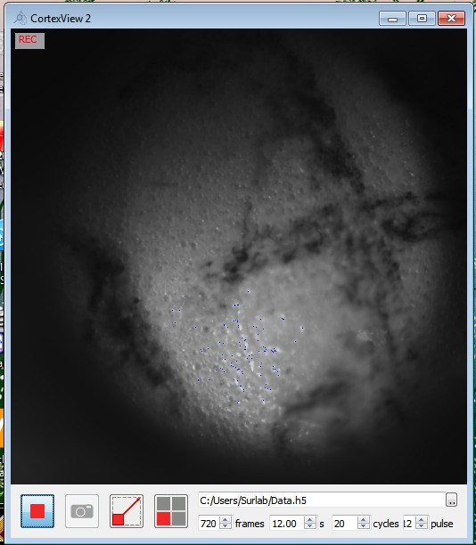
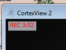

See an example hardware setup here: 

# CortexView2 the imagine software

You need the camera to be on to open this software.
It is also assumed that the photodiode is connected to the NIDAQ board and, in turn, connected to the imaging computer.
The reverse bias voltage on the photodiode doesn't necessarily has to be on before you start this software, but it needs to be on for recording.

## Interface

1. You can click-drag-release in the main window to define an ROI, and only pixels in the ROI will be included in the recording, greatly reduce recording file size.
Click this button to reset the ROI selection to the full screen.
2. The camera can do a 2x2 bin, which gives better sensitivity at lower resolution.
If you think about it, it reduces dynamic range to 1/4, so in general we do not use the binned setting.
I should make it not a default at some point but for now every time you open the program it defaults to binned recording,
click once to turn off.
3. Continuous imaging assumes a periodic stimulus.
The recording side would like to know the period of this stimulus, both in terms of frame number and time.
Note that this frame number is of the stimulus monitor, not of the camera acquisition.
4. A flickering block appears in the bottom right corner of the stimulus monitor, to send timing signal to the diode and sync with the camera input.
The problem is that now the monitor is LCD, there is a slow fluorescent timecourse involved.
At 60Hz you can't detect any fluctuation on the photodiode.
Here I set the sync signal to fire once every 6 frames, reducing the photodiode signal to 10Hz.
If you have some real trouble with the sync signal, you may want to increase this value, but do change it on the stimulus side.

### Light level indication

You want to have as much lighting as possible without overflowing the camera to maximize signal, since the signal is ~5% modulation of your lighting.
Once you arrange the lighting fibers and close the light blocker, the only way to adjust lighting level is changing the voltage sent to the bulb.

On the CMOS, if you have too many photons each frame, it will have a quantum overflow on the electron well.
You see a locally smeared picture if there is quantum overflow.
On the other hand, once the photons are counted, it only goes up to 65535 so if it's too bright you get digital overflow.
In this camera, you always get quantum overflow before you get digital overflow, unless you turn on 2x2 binning, in which case you always get digital overflow first.

I set two visual helpers to control light level.
Pixels at 65535 is shown as red.

To avoid quantum overflow, visually check the image to see there is no smear.
When 2x2 binning is turned off, I set the blue pixel about 100 below what usually gives quantum overflow.
So to reach the maximal lighting, allow a little bit of blue pixels circling your area of most interest.

## Recording

### Recording status

There are three status: Standby = nothing happening; REC = waiting for stimulus to start; REC + time = recording, time is what's left for this recording session.

When you start recording, the system goes into waiting mode, and will only start the recording when the stimulus starts (the sync block lights up).
When you hit stop during recording, the system goes back to standby regardless of stimulus state.
You will need to manually stop the stimulus or wait for it to end.

# Check Result

Luck is critical in intrinsic signal OI.
Because of the low signal, any noise introduced will destroy your recording.
There are some precautions to take:
- Do not give too much iso, or it silences the cortex.
- Do not let the animal move, the cortex should not move. Give enough sedatives and a little bit of iso.
- Keep light stable. Regular home bulbs and the electric grid can easily fluctuate more than 5%, then you don't have any signal.
This is why we need the power supply stabilizer. You can lock the voltage for a little better performance.
    - Heat up the bulb properly. Both the power supply and the bulb has some fluctuation when first start up.
    - Adjust the fiber. Center of the light spot gives best stability.
    - Use both fibers, at your ROI the light spots should overlap to get rid of shadows.
    - Essentially, you want as low voltage on the bulb as possible given camera acquisition just below saturation/overflow.
- Both types of camera overflow kill your signal.
- No light leak. It's a very strong periodic noise so even just a little bit can do a lot of harm.
- Pick your stimulus period far away from potential noise, like mouse heart rate, breath rate, and electric grid frequency.
